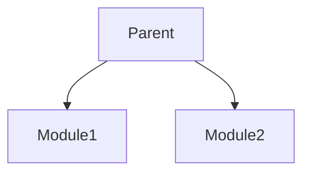

# Maven 

## Project with multiple modules

### Exclude dependency when running unit tests
In this example we excluded dependency HikariCP when running unit tests to avoid manage connection pool 

			<plugin>
				<groupId>org.apache.maven.plugins</groupId>
				<artifactId>maven-surefire-plugin</artifactId>
				<configuration>
					<classpathDependencyExcludes>
						<classpathDependencyExclude>com.zaxxer:HikariCP</classpathDependencyExclude>
					</classpathDependencyExcludes>
				</configuration>
			</plugin>